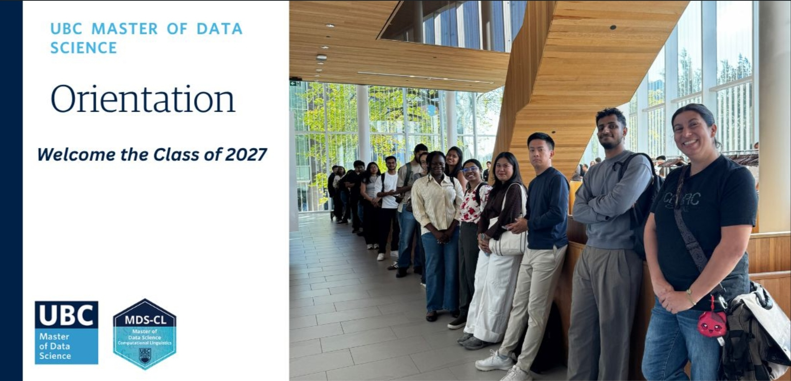
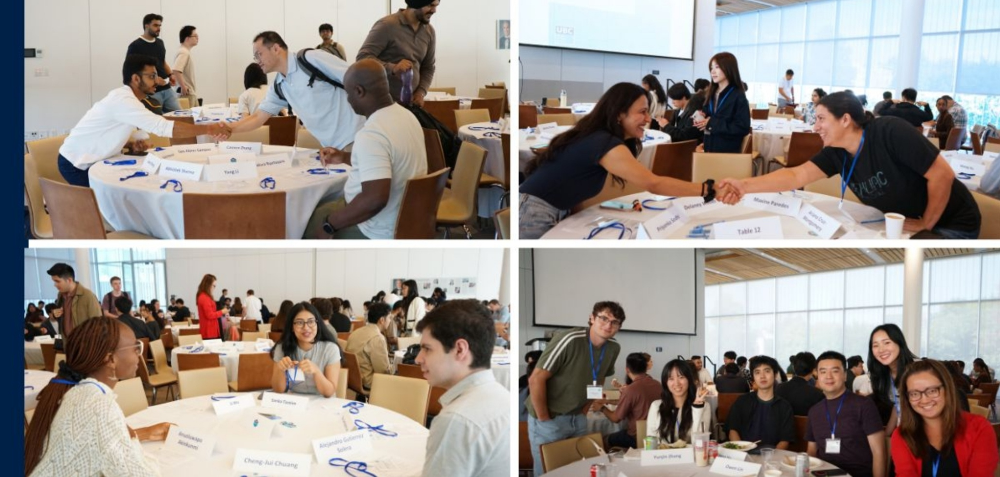

Starting the Master of Data Science program has been a whirlwind, and I wanted to capture my first week here while it's still fresh. Orientation ran for three days, and each one brought something a little different.

Day 1: Information Overload (In a Good Way)

The first day was packed with information. We met the MDS faculty members, who were incredibly welcoming from the very first hello. I also started making connections with other students in the room — many of them from different countries, which made for a genuinely interesting mix of backgrounds and perspectives. It was a lot to take in, and honestly a bit of a stretch mentally, but it was fun getting to know everyone.

Day 2: Teamwork and Real Talk with Alumni

Day two had more spice, literally and figuratively. We took part in a campus scavenger hunt, working in teams — a great, low-stakes way to build teamwork skills right out of the gate. Later, we had alumni come speak to us, and we got the chance to ask them questions as a group as well as chat with them one-on-one. Hearing their honest experiences made the program feel a lot more real and less abstract.

And, of course, there was no shortage of food and drinks throughout all three days. It made the long days a lot more enjoyable.

Day 3: Looking Ahead

The last day wrapped up with dinner and a session where alumni shared their capstone projects. It was a genuinely wonderful way to get a glimpse of what the next 10 months might look like. Beyond the project examples themselves, the survival tips they shared were probably the biggest takeaway for me along with a reminder of just how much working as a team and building community matters throughout the program.

Reflecting Back

Three days in, and I already feel like I've learned as much about the people around me as I have about the program itself. If this week is any indication, the next 10 months are going to be intense, but full of good people to go through it with.